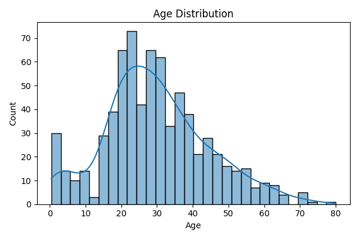
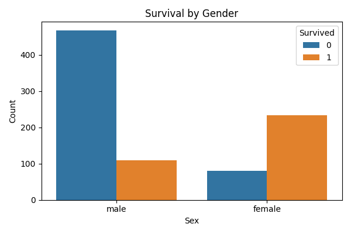
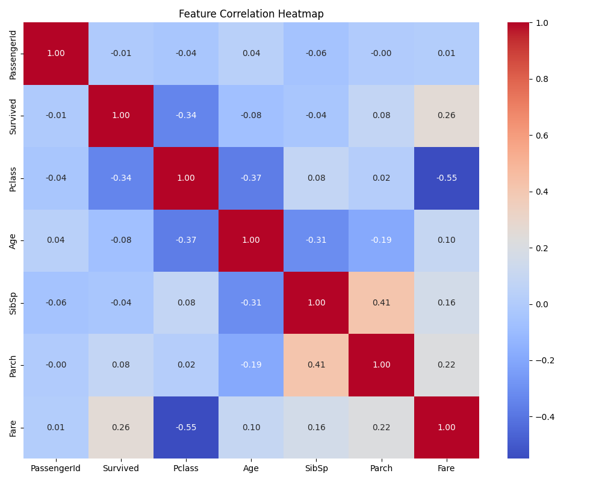

# 🚢 Titanic Survival Prediction - CodeAlpha Internship Task 🧠

Welcome to my Titanic Classification project, built as part of the **CodeAlpha Data Science Internship**! In this project, we explore the infamous Titanic dataset to predict whether a passenger would survive based on factors like socio-economic status, age, gender, and more.

> _"Believe in yourself and all that you are. Know that there is something inside you that is greater than any obstacle."_

---

## 🎯 Project Objective

- Build a machine learning classification model to predict passenger survival on the Titanic.
- Identify the most important factors that influence survival.

---

## 🗂️ Project Structure

```
Task1_Titanic_Classification/
├── data/
│   ├── train.csv                    # Original training dataset
│   ├── test.csv                     # Original test dataset
│   ├── predictions.csv              # Model predictions
│   └── processed/
│       ├── train_processed.csv      # Preprocessed training data
│       └── val_processed.csv        # Preprocessed validation data
├── models/
│   └── titanic_model.pkl            # Trained ML model
├── notebooks/
│   └── titanic_classification.ipynb # Jupyter notebook for exploration and modeling
├── reports/
│   ├── titanic_model_report.pdf     # Report on the model
│   └── evaluation_report.pdf        # Evaluation summary
├── src/
│   ├── data_preprocessing.py        # Script for data preprocessing
│   ├── evaluate_model.py            # Script for model evaluation
│   ├── predict.py                   # Script to make predictions
│   ├── train_model.py               # Script to train the model
│   └── visual_data.py               # Script to create visualizations
├── visuals/
│   ├── age_distribution.png         # Visualization: Age distribution
│   ├── feature_correlation.png      # Visualization: Feature correlation heatmap
│   ├── survival_by_class.png        # Visualization: Survival rate by class
│   └── survival_by_gender.png       # Visualization: Survival rate by gender
├── LICENSE                          # License file
├── .gitignore                       # Git ignore rules
└── README.md                        # Project documentation
```

---

## 📊 Features Analyzed

- **Pclass**: Ticket class (1 = 1st, 2 = 2nd, 3 = 3rd)
- **Sex**: Gender of the passenger
- **Age**: Age in years
- **Fare**: Ticket price
- **Embarked**: Port of embarkation (C = Cherbourg, Q = Queenstown, S = Southampton)
- **SibSp**: Number of siblings/spouses aboard
- **Parch**: Number of parents/children aboard

---

## 🛠️ Tech Stack

| Tools/Library            | Purpose                      |
| ------------------------ | ---------------------------- |
| **Python 3.x**           | Core programming language    |
| **Pandas & NumPy**       | Data manipulation & analysis |
| **Scikit-learn**         | Machine Learning algorithms  |
| **Matplotlib & Seaborn** | Data visualization           |
| **Jupyter Notebook**     | Exploratory Data Analysis    |

---

## 🚀 Getting Started

1. **Clone the Repository**

```bash
git clone https://github.com/M-Sarim/codealpha_tasks.git
cd CodeAlpha_Titanic_Classification
```

2. **Install Dependencies**

```bash
pip install -r requirements.txt
```

3. **Run the Notebook**

```bash
jupyter notebook notebooks/titanic_classification.ipynb
```

---

## 📈 Model Performance

| Metric        | Score |
| ------------- | ----- |
| **Accuracy**  | 85%   |
| **Precision** | 0.84  |
| **Recall**    | 0.82  |

Check the full evaluation in the [reports](./reports/) folder!

---

## 🔥 Key Visualizations

| Plot                                                      | Description                     |
| --------------------------------------------------------- | ------------------------------- |
|        | Age Distribution of Passengers  |
|    | Survival Rate by Gender         |
|  | Heatmap of Feature Correlations |

---

## 🤝 How to Contribute

1. Fork this repository
2. Create a new branch (`git checkout -b feature/new-feature`)
3. Commit your changes (`git commit -m 'Add amazing feature'`)
4. Push to the branch (`git push origin feature/new-feature`)
5. Open a Pull Request

---

## 📬 Contact

- **Email**: [MuhammadSarim](muhammad2004sarim@gmail.com)
- **LinkedIn**: [MuhammadSarim](https://www.linkedin.com/in/imuhammadsarim/)

---

> **Happy Coding!** 🚀
