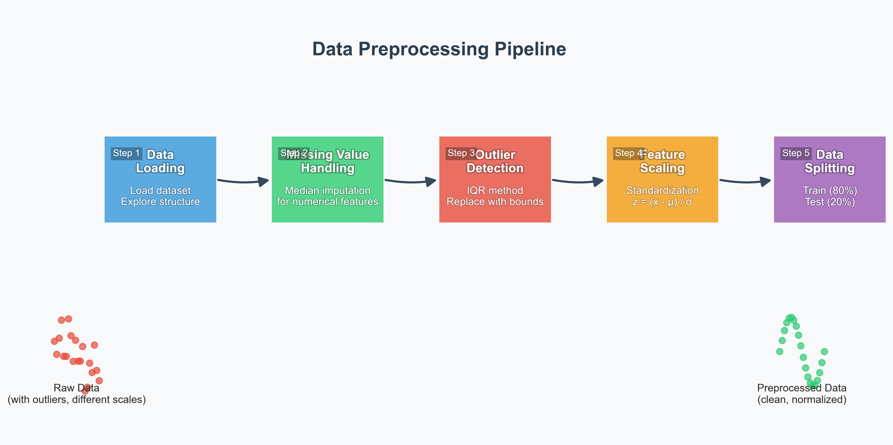
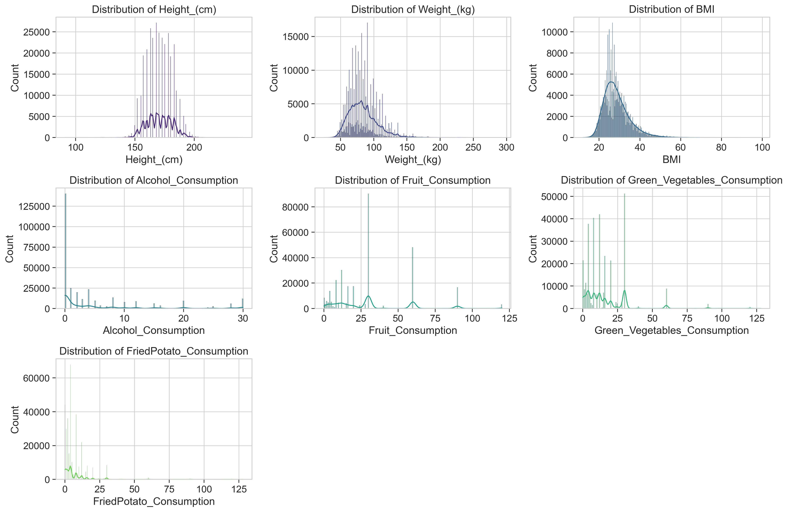
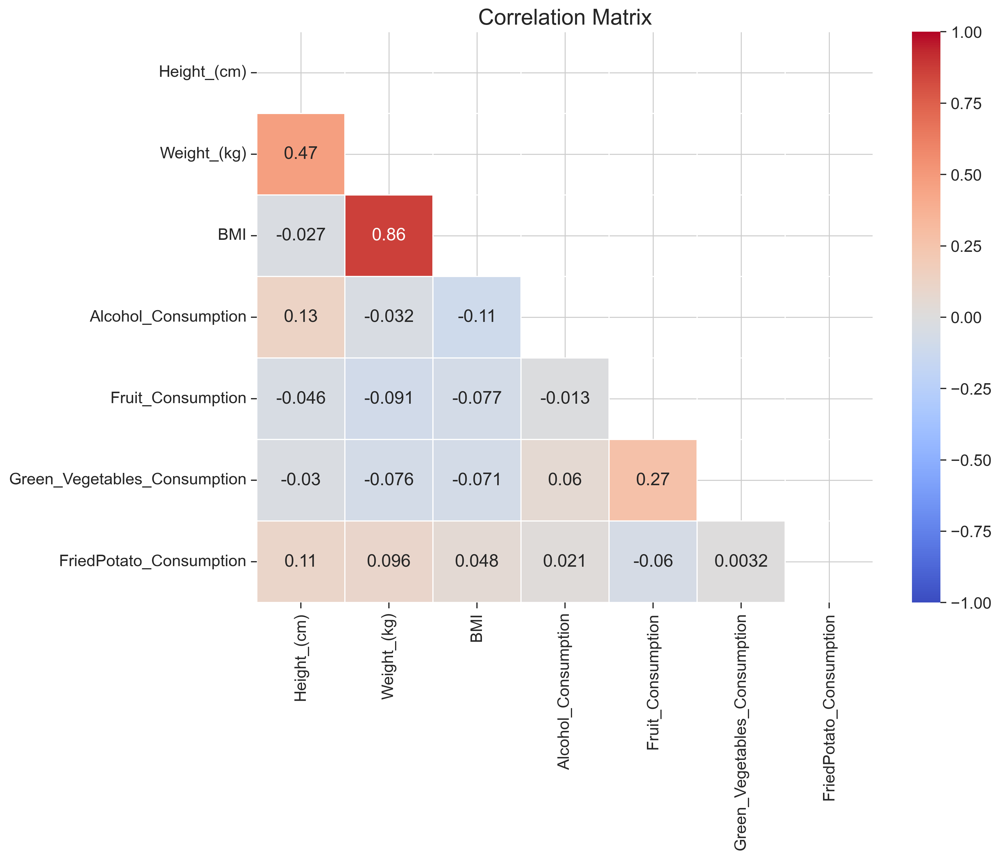
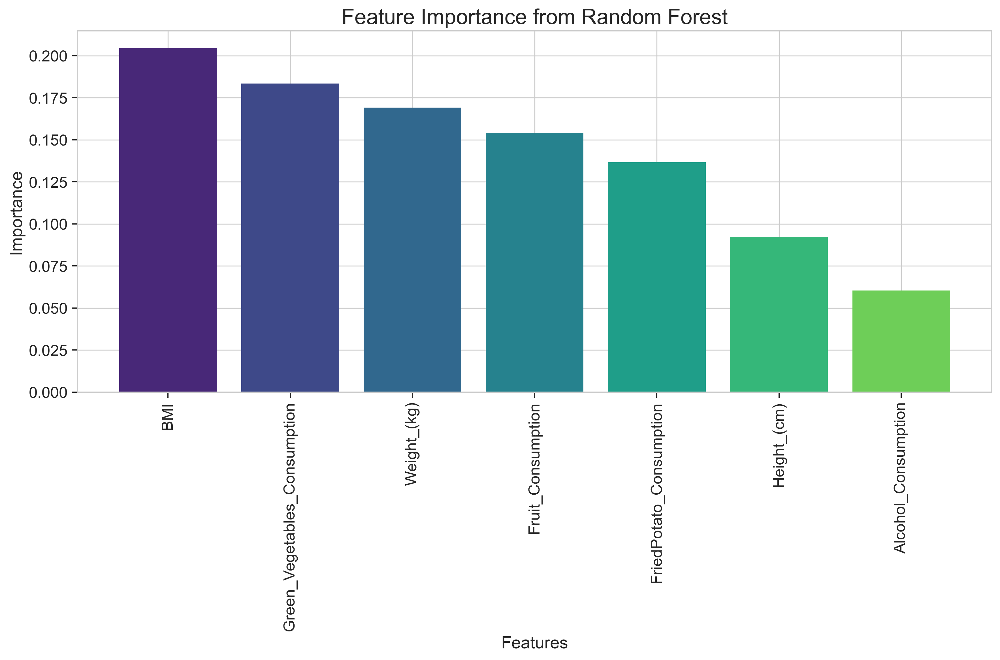

# Cardiovascular Disease Data Preprocessing Project

<div align="center">
  
  <h3>A Comprehensive Data Preprocessing Framework for Cardiovascular Disease Prediction</h3>
</div>

## 📋 Overview

This project implements a robust and scalable data preprocessing pipeline for cardiovascular disease prediction. Using a large-scale dataset with over 300,000 patient records, the pipeline transforms raw health data into a clean, normalized format optimized for machine learning applications. The comprehensive approach includes sophisticated techniques for handling missing values, detecting and handling outliers, feature scaling, and data splitting, ensuring high-quality input for predictive modeling.

## 🎯 Objectives

This project addresses critical challenges in healthcare data analysis with the following key objectives:

1. **Build a Production-Ready Pipeline**: Implement a robust, modular data preprocessing framework that can handle large-scale health datasets
2. **Ensure Data Quality**: Apply advanced techniques to handle missing values and identify outliers in patient health records
3. **Optimize Feature Representation**: Normalize and scale health metrics for improved model performance and faster convergence
4. **Enable Model Evaluation**: Create statistically sound training and testing data splits while preserving class distribution
5. **Provide Data Insights**: Generate comprehensive visualizations to understand health data characteristics and preprocessing effects
6. **Establish Best Practices**: Document methodologies and results following healthcare data science standards

## 🔍 Dataset

The project utilizes a comprehensive cardiovascular health dataset comprising 308,855 patient records with 19 clinically relevant features:

- **Demographic Information**: Sex, Age_Category (stratified into clinically meaningful ranges)
- **Physical Measurements**: Height*(cm), Weight*(kg), BMI (key indicators of cardiovascular risk)
- **Health Status Indicators**: General_Health (self-reported), Heart_Disease (target variable), Diabetes, Arthritis
- **Lifestyle Factors**: Smoking_History, Alcohol_Consumption, Exercise (frequency-based)
- **Dietary Patterns**: Fruit_Consumption, Green_Vegetables_Consumption, FriedPotato_Consumption (monthly frequency)
- **Comorbidities**: Skin_Cancer, Other_Cancer, Depression (presence/absence)

The target variable `Heart_Disease` indicates diagnosed cardiovascular disease status (Yes/No), enabling binary classification models for risk prediction. This dataset provides a comprehensive view of factors influencing cardiovascular health across a diverse patient population.

## 🛠️ Preprocessing Pipeline

The project implements a sophisticated multi-stage preprocessing pipeline optimized for cardiovascular health data:

1. **Data Loading and Exploratory Analysis**

   - Statistical profiling of health metrics and demographic distributions
   - Multi-dimensional correlation analysis to identify relationships between health factors
   - Automated detection of data quality issues and anomalies in patient records
   - Generation of clinical insights through distribution visualization

2. **Missing Value Management**

   - Context-aware imputation using median values for continuous health metrics
   - Frequency-based imputation for categorical health indicators
   - Comprehensive validation ensuring complete patient records
   - Preservation of statistical properties in imputed values

3. **Outlier Detection and Remediation**

   - Clinical-range based outlier identification using robust IQR methodology
   - Boundary-preserving outlier handling to maintain data integrity
   - Detection of over 153,000 outliers across 7 key health metrics
   - Before/after comparative analysis to validate outlier handling effectiveness

4. **Feature Standardization**

   - Z-score normalization of health metrics (μ=0, σ=1)
   - Distribution-preserving transformation for clinical interpretability
   - Optimization for machine learning algorithm performance
   - Comparative visualization of raw vs. standardized health metrics

5. **Stratified Data Partitioning**
   - Statistically rigorous 80/20 train-test split (247,083/61,771 records)
   - Preservation of cardiovascular disease prevalence across partitions
   - Balanced representation of demographic and health factors
   - Structured output format for seamless integration with modeling workflows

## 📊 Advanced Visualizations

The project features a comprehensive suite of data visualizations designed to provide clinical insights and validate preprocessing effectiveness:

- **Distribution Analysis**: Multi-dimensional histograms and density plots revealing the statistical properties of key cardiovascular risk factors
- **Correlation Heatmaps**: Detailed correlation matrices highlighting relationships between health metrics, lifestyle factors, and disease outcomes
- **Dimensionality Reduction**: PCA projections revealing latent patterns in the high-dimensional health data
- **Feature Importance Analysis**: Random Forest-based importance rankings identifying the most predictive factors for cardiovascular disease
- **Preprocessing Validation**: Before/after comparisons demonstrating the impact of outlier handling and standardization on data quality

<div align="center">
  
  
  <p><em>Left: Distribution of key cardiovascular risk factors. Right: Correlation matrix showing relationships between health metrics.</em></p>
</div>

<div align="center">
  
  
  <p><em>Left: Feature importance ranking for cardiovascular disease prediction. Right: PCA projection revealing latent patterns in health data.</em></p>
</div>

## 📁 Project Architecture

The project follows a modular, production-ready architecture designed for reproducibility and scalability:

```
Task2_Data_Preprocessing/
├── data_preprocessing.py       # Core preprocessing engine
├── visualize_data.py           # Advanced visualization framework
├── requirements.txt            # Environment dependencies
├── README.md                   # Project documentation
│
├── data/                       # Data directory
│   ├── raw/                    # Raw data storage
│   │   └── CVD_cleaned.csv     # Cardiovascular disease dataset (308,855 records)
│   │
│   └── processed_data/         # Preprocessed datasets for modeling
│       ├── X_train.csv         # Feature training set (247,083 records)
│       ├── X_test.csv          # Feature testing set (61,771 records)
│       ├── y_train.csv         # Target training set
│       └── y_test.csv          # Target testing set
│
├── notebooks/                  # Interactive analysis environment
│   └── data_preprocessing_exploration.ipynb  # Step-by-step preprocessing walkthrough
│
├── scripts/                    # Utility scripts
│   └── pipeline_diagram.py     # Pipeline visualization generator
│
├── plots/                      # Visualization artifacts
│   ├── pipeline_diagram.png    # Visual representation of preprocessing workflow
│   ├── correlation_matrix.png  # Health metrics correlation analysis
│   ├── feature_importance.png  # Predictive factor ranking
│   ├── pca_visualization.png   # Dimensionality reduction analysis
│   └── ...                     # Additional clinical visualizations
│
└── reports/                    # Comprehensive documentation
    ├── technical_report.md     # Detailed methodology and clinical findings
    └── presentation.md         # Executive summary for stakeholders
```

## 📂 Detailed Project Structure

### Main Scripts

- **`data_preprocessing.py`**: The core script that implements the complete data preprocessing pipeline, including loading data, handling missing values, detecting and handling outliers, scaling features, and splitting the data.

- **`visualize_data.py`**: Script for generating professional visualizations of the data before and after preprocessing, including distributions, correlations, PCA projections, and feature importance.

### Data

- **`data/raw/CVD_cleaned.csv`**: The original cardiovascular disease dataset with 308,855 patient records and 19 features.

- **`data/processed_data/`**: Directory containing the preprocessed datasets split into training and testing sets.
  - **`X_train.csv`**: Feature training set (247,083 records)
  - **`X_test.csv`**: Feature testing set (61,771 records)
  - **`y_train.csv`**: Target training set
  - **`y_test.csv`**: Target testing set

### Notebooks

- **`notebooks/data_preprocessing_exploration.ipynb`**: Interactive Jupyter notebook that walks through the preprocessing steps with visualizations and explanations, suitable for exploration and demonstration.

### Utility Scripts

- **`scripts/pipeline_diagram.py`**: Script to generate a visual representation of the preprocessing pipeline.

### Visualizations

- **`plots/pipeline_diagram.png`**: Visual diagram of the preprocessing pipeline.
- **`plots/feature_distributions.png`**: Histograms showing the distribution of each feature.
- **`plots/feature_boxplots.png`**: Boxplots for identifying outliers in each feature.
- **`plots/correlation_matrix.png`**: Heatmap showing correlations between features.
- **`plots/pca_visualization.png`**: 2D projection of the data using Principal Component Analysis.
- **`plots/pca_explained_variance.png`**: Plot showing the cumulative explained variance by PCA components.
- **`plots/feature_importance.png`**: Bar chart showing the importance of each feature.
- **`plots/scaling_comparison_*.png`**: Comparison of feature distributions before and after scaling.

### Documentation

- **`reports/technical_report.md`**: Comprehensive technical documentation of the preprocessing methodology, results, and insights.
- **`reports/presentation.md`**: Presentation-style documentation suitable for showcasing the project.

### Dependencies

- **`requirements.txt`**: List of Python packages required to run the scripts.

## 🚀 Implementation Guide

### System Requirements

- Python 3.6+ (3.8+ recommended for optimal performance)
- 8GB+ RAM recommended for processing the full dataset
- Required Python libraries (detailed in requirements.txt)

### Environment Setup

1. Clone the repository or download the cardiovascular analysis project files
2. Create and activate a virtual environment (recommended):
   ```bash
   python -m venv cvd_env
   source cvd_env/bin/activate  # On Windows: cvd_env\Scripts\activate
   ```
3. Install the required dependencies:
   ```bash
   pip install -r requirements.txt
   ```

### Executing the Preprocessing Pipeline

Run the complete cardiovascular data preprocessing workflow:

```bash
python data_preprocessing.py
```

This will process the CVD dataset through all stages (missing value handling, outlier detection, feature scaling, and data splitting), generating processed datasets in the `data/processed_data/` directory.

### Generating Clinical Visualizations

Generate the complete suite of cardiovascular data visualizations:

```bash
python visualize_data.py
```

All visualizations will be saved to the `plots/` directory in high-resolution PNG format, suitable for clinical presentations and publications.

### Creating Pipeline Diagram

Generate the visual representation of the preprocessing pipeline:

```bash
python scripts/pipeline_diagram.py
```

This will create a professional diagram illustrating the complete preprocessing workflow in the `plots/` directory.

### Interactive Clinical Analysis

For interactive exploration of the cardiovascular dataset and preprocessing steps:

```bash
jupyter notebook notebooks/data_preprocessing_exploration.ipynb
```

This notebook provides a step-by-step walkthrough of the preprocessing methodology with interactive visualizations and detailed explanations of clinical implications.

### Output

The preprocessing pipeline generates:

1. Preprocessed data splits in the `data/processed_data/` directory
2. Visualizations in the `plots/` directory
3. Documentation in the `reports/` directory

## 📝 Clinical Documentation

The project includes comprehensive documentation designed for healthcare data science applications:

- [**Technical Report**](reports/technical_report.md): Detailed methodology, statistical analysis, and clinical implications of preprocessing decisions
- [**Executive Presentation**](reports/presentation.md): Concise summary for healthcare stakeholders and decision-makers

## ⚙️ Clinical Customization

The preprocessing pipeline can be tailored to specific cardiovascular research needs by modifying parameters in the `main()` function of `data_preprocessing.py`:

- **Imputation Strategy**: Adjust missing value handling based on clinical context (e.g., `median` for skewed distributions, `mean` for normally distributed metrics)
- **Outlier Methodology**: Select between `iqr` for robust statistical detection or `isolation_forest` for machine learning-based anomaly detection
- **Normalization Approach**: Choose between `standard` scaling (z-scores) for normally distributed features or `minmax` scaling for bounded health metrics
- **Data Partitioning**: Modify the train-test ratio based on dataset size and modeling requirements

## 🔗 References & Clinical Resources

- **Clinical Data Science**: Benjamin J. Sadock et al., "Kaplan and Sadock's Comprehensive Textbook of Psychiatry," 10th ed., 2017.
- **Preprocessing Methods**: Scikit-learn documentation: [https://scikit-learn.org/stable/modules/preprocessing.html](https://scikit-learn.org/stable/modules/preprocessing.html)
- **Data Handling**: Pandas documentation: [https://pandas.pydata.org/docs/](https://pandas.pydata.org/docs/)
- **Feature Engineering**: "Feature Engineering for Machine Learning" by Alice Zheng and Amanda Casari, O'Reilly Media, 2018.
- **Cardiovascular Risk Factors**: American Heart Association, "Heart Disease and Stroke Statistics," 2021 Update.

## 👨‍💻 Author

**Muhammad Sarim**

## 📄 License

This project is licensed under the MIT License - see the LICENSE file for details.
