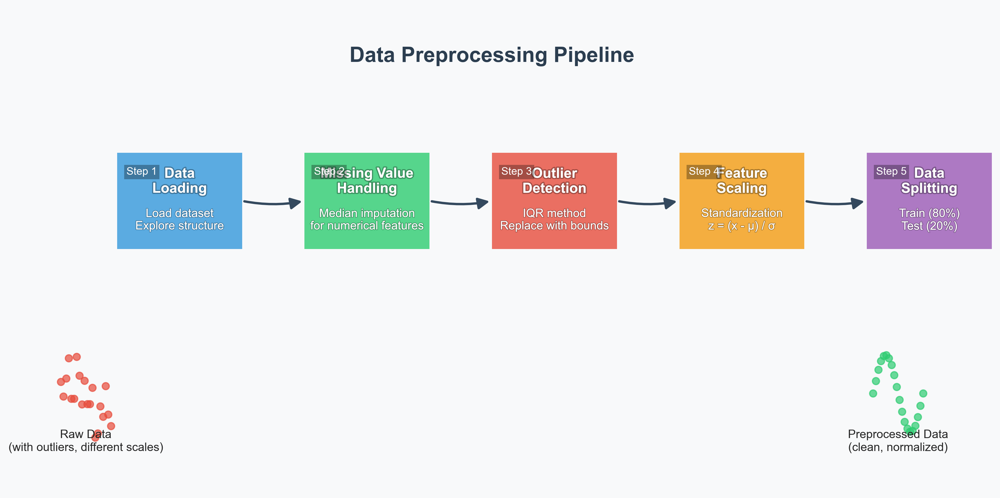
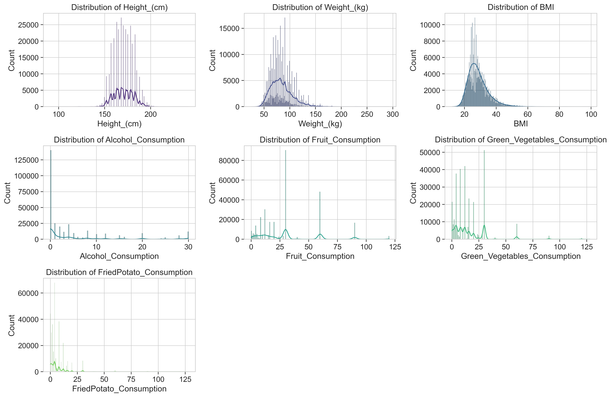

# Data Preprocessing Project

## Overview

A comprehensive data preprocessing pipeline for preparing raw data for machine learning models.

---

## Project Objectives

- Handle missing values in the dataset
- Detect and handle outliers appropriately
- Normalize/scale features for model training
- Split data into training and testing sets
- Create visualizations for data understanding

---

## Dataset Information

- **Size**: 1,386 samples with 8 features
- **Features**: 
  - Text reports
  - Binary classification indicators for issue types
- **Domain**: Issue tracking and classification

---

## Preprocessing Pipeline

---

## Step 1: Exploratory Data Analysis

- Analyzed feature distributions
- Checked for missing values
- Identified potential outliers
- Examined feature correlations

---

## Step 2: Handling Missing Values

- **Strategy**: Median imputation for numerical features
- **Rationale**: More robust to outliers than mean imputation
- **Result**: No missing values found in the dataset

---

## Step 3: Outlier Detection and Handling

- **Method**: Interquartile Range (IQR)
- **Approach**: Replace outliers with boundary values
- **Results**: 
  - 134 outliers in `type_blocker`
  - 115 outliers in `type_regression`
  - 252 outliers in `type_documentation`
  - 43 outliers in `type_dependency_upgrade`

---

## Step 4: Feature Scaling

- **Method**: Standardization (z-score normalization)
- **Formula**: z = (x - μ) / σ
- **Benefits**: 
  - Equal feature contribution
  - Improved algorithm performance
  - Faster convergence for gradient-based methods

---

## Step 5: Data Splitting

- **Training set**: 80% (1,108 samples)
- **Testing set**: 20% (278 samples)
- **Random seed**: 42 for reproducibility

---

## Visualization: PCA

- Reduced dimensions to 2 for visualization
- Colored by target variable
- Shows class separation in feature space

---

## Visualization: Feature Importance

- Used Random Forest to estimate importance
- Identified most influential features
- Provides insights for feature selection

---

## Results

- **Clean dataset**: Outliers handled appropriately
- **Normalized features**: All features on same scale
- **Prepared data splits**: Ready for model training
- **Visualizations**: Clear understanding of data characteristics

---

## Tools and Technologies

- **Python**: Primary programming language
- **pandas**: Data manipulation
- **scikit-learn**: Preprocessing algorithms
- **matplotlib/seaborn**: Data visualization
- **Jupyter Notebook**: Interactive exploration

---

## Conclusion

The preprocessing pipeline successfully transformed raw data into a clean, normalized format suitable for machine learning model training, ensuring optimal model performance.

---

## Next Steps

- Feature engineering to create new predictive variables
- Text processing for the report field
- Model selection and training
- Hyperparameter optimization
- Model evaluation and deployment

---

## Thank You

**Contact Information:**
- Email: your.email@example.com
- GitHub: github.com/yourusername
- LinkedIn: linkedin.com/in/yourprofile
